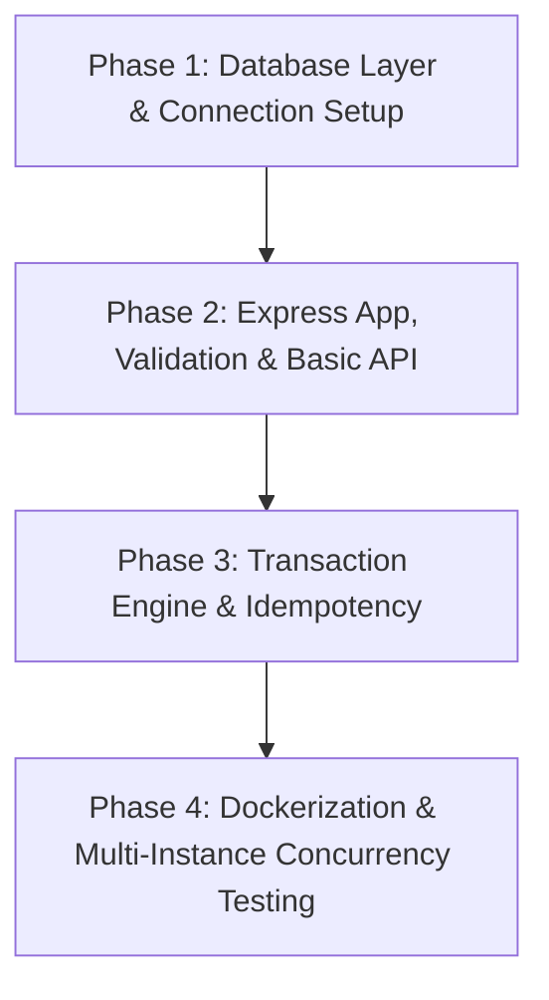

# Software Requirements Specification (SRS)
## Coupon Redemption Service

**Document Version:** 1.0.0  
**Status:** Approved for Implementation  
**Technology Stack:** Node.js, Express.js, express-validator, MySQL (InnoDB), Docker & Docker Compose  

---

## 1. System Overview & Objectives

The **Coupon Redemption Service** is a high-reliability, transactionally consistent backend engine designed for e-commerce checkout systems. During high-traffic events (e.g., flash sales), multiple distributed instances of the checkout application concurrently attempt to redeem limited-quantity promotional codes.

The system ensures strict ACID properties:
* Preventing over-allocation beyond `max_redemptions`.
* Enforcing single-use policies per customer for standard coupons.
* Providing atomic validation against expiration deadlines.
* Guaranteeing idempotency under network retries.
* Supporting idempotent order cancellations that safely return allocated coupon slots.

---

## 2. Functional Requirements (FR)

### FR-1: Coupon Creation & Seeding (`POST /coupons`)
* **FR-1.1**: The system must allow administrators/merchants to register coupons with the following properties:
  * `code`: Unique, alphanumeric, case-sensitive string identifier (e.g., `FLASHSALE50`).
  * `max_redemptions`: Strict positive integer defining the maximum number of times the coupon can ever be redeemed globally.
  * `discount_percent`: Integer from 1 to 100 representing the discount percentage.
  * `expires_at`: ISO 8601 UTC timestamp indicating expiration date and time.
  * `type`: Categorical value, strictly either `STANDARD` or `STACKABLE`.
* **FR-1.2**: If a coupon code already exists, the creation request must be rejected with HTTP `409 Conflict`.
* **FR-1.3**: All fields must be strictly validated before database execution.

### FR-2: Coupon Redemption (`POST /redeem`)
* **FR-2.1**: The endpoint must accept:
  * HTTP Header: `Idempotency-Key` (required, non-empty unique string).
  * Payload: `{ "code": string, "customer_id": string, "order_id": string }`.
* **FR-2.2 (Global Limit)**: A coupon cannot be redeemed more than `max_redemptions` times globally, even under extreme burst concurrency across distributed instances.
* **FR-2.3 (Customer Limit - STANDARD)**: If the coupon is of type `STANDARD`, it can only be redeemed once per `customer_id` ever. Subsequent attempts by the same customer must fail with a distinct error.
* **FR-2.4 (Customer Limit - STACKABLE)**: If the coupon is of type `STACKABLE` (e.g., referral codes), the same `customer_id` may redeem it multiple times across different orders, provided the global `max_redemptions` is not exceeded.
* **FR-2.5 (Atomic Expiration Check)**: A coupon redeemed when `CURRENT_TIMESTAMP >= expires_at` must be rejected immediately. In-flight redemptions at the exact expiry boundary must resolve deterministically via database server timestamp `NOW(3)`.
* **FR-2.6 (Order Uniqueness)**: An `order_id` cannot redeem more than one coupon slot simultaneously.
* **FR-2.7 (Response Contract)**:
  * On success: HTTP `200 OK` with `{ "success": true, "remaining": <int>, "redeemed_count": <int> }`.
  * Distinct error modes with standardized status codes:
    * `404 Not Found`: Unknown coupon code (`UNKNOWN_COUPON`).
    * `410 Gone`: Expired coupon (`COUPON_EXPIRED`).
    * `409 Conflict`: Global quota exhausted (`MAX_REDEMPTIONS_REACHED`).
    * `409 Conflict`: Customer already used standard coupon (`ALREADY_REDEEMED_BY_CUSTOMER`).
    * `409 Conflict`: Order already has a redemption (`ORDER_ALREADY_REDEEMED`).

### FR-3: Idempotency Engine
* **FR-3.1**: Callers must send an `Idempotency-Key` on every `POST /redeem` request.
* **FR-3.2**: When a network client retries a request with an existing `Idempotency-Key`:
  * If the previous request succeeded, return the identical HTTP `200 OK` payload without double-decrementing slots or creating redundant records.
  * If the previous request failed with a client error (e.g. `COUPON_EXPIRED`), return the identical error.
  * If the key is currently being processed by another worker thread/process, return HTTP `409 Conflict` or lock until completion.
* **FR-3.3**: The system must verify that request parameters match the original request hash for that `Idempotency-Key`; mismatched payloads with the same key must return HTTP `422 Unprocessable Entity`.

### FR-4: Order Cancellation & Slot Rollback (`POST /orders/:order_id/cancel`)
* **FR-4.1**: Cancelling an order that redeemed a coupon must release the slot back (`redeemed_count` decrements by 1).
* **FR-4.2**: The cancellation operation must be strictly idempotent:
  * First invocation: Reverses the coupon redemption, returns slot, marks record as `CANCELLED`, returns HTTP `200 OK` (`slot_returned: true`).
  * Second and subsequent invocations: No-op, does not return extra slots, returns HTTP `200 OK` (`slot_returned: false`, `already_cancelled: true`).
* **FR-4.3**: If no redemption is associated with the `order_id`, return HTTP `404 Not Found` (`ORDER_NOT_FOUND`).

### FR-5: Real-Time Coupon State Query (`GET /coupons/:code`)
* **FR-5.1**: Returns the real-time status: `{ "code": string, "redeemed_count": number, "remaining": number, "max_redemptions": number, "type": string, "expires_at": string }`.
* **FR-5.2**: The counts must reflect immediate consistency (read directly from the transactional database, not an eventually consistent cache or stale read).

---

## 3. Non-Functional Requirements (NFR)

### NFR-1: Multi-Process Concurrency & Zero In-Memory Locks
* **NFR-1.1**: The application must be horizontally scalable across multiple standalone operating system processes/containers.
* **NFR-1.2**: In-memory locks (Node.js Mutex, Semaphore, global variables) are strictly forbidden for correctness guarantees.
* **NFR-1.3**: All concurrency safety, atomicity, and serializability must be guaranteed by MySQL InnoDB row-level locking (`SELECT ... FOR UPDATE`), transaction isolation levels, and relational constraints.

### NFR-2: Data Integrity & Invariants
* **NFR-2.1**: Invariant: $0 \le \text{redeemed\_count} \le \text{max\_redemptions}$ must never be violated at any point in time.
* **NFR-2.2**: The schema must enforce database-level `CHECK (redeemed_count <= max_redemptions)` and `CHECK (redeemed_count >= 0)` as hardware/engine-level safety guards.

### NFR-3: Performance & Scalability
* **NFR-3.1**: Fast lock duration: Database transactions must remain minimal in scope (no external network I/O inside transaction blocks) to minimize row-lock hold times.
* **NFR-3.2**: Indexed lookups: All lookups (`code`, `order_id`, `(coupon_id, customer_id, status)`) must use B-Tree indexes.

### NFR-4: Validation & Error Handling
* **NFR-4.1**: Input validation using `express-validator` to guarantee fail-fast behavior before touching database connections.
* **NFR-4.2**: Consistent error payload structure:
  ```json
  {
    "success": false,
    "error": "ERROR_CODE",
    "message": "Human-readable description"
  }
  ```

### NFR-5: Containerization & Portability
* **NFR-5.1**: Fully reproducible setup via `Dockerfile` and `docker-compose.yml`.
* **NFR-5.2**: The Docker setup must run MySQL 8.0 alongside at least **two identical app instances** (`app1` on port 3001, `app2` on port 3002) connected to the shared database.

---

## 4. Database Schema Design (MySQL InnoDB)

```sql
-- Table: coupons
CREATE TABLE IF NOT EXISTS coupons (
    id BIGINT AUTO_INCREMENT PRIMARY KEY,
    code VARCHAR(64) NOT NULL UNIQUE,
    max_redemptions INT UNSIGNED NOT NULL,
    redeemed_count INT UNSIGNED NOT NULL DEFAULT 0,
    discount_percent TINYINT UNSIGNED NOT NULL,
    expires_at DATETIME(3) NOT NULL,
    type ENUM('STANDARD', 'STACKABLE') NOT NULL,
    created_at TIMESTAMP(3) DEFAULT CURRENT_TIMESTAMP(3),
    updated_at TIMESTAMP(3) DEFAULT CURRENT_TIMESTAMP(3) ON UPDATE CURRENT_TIMESTAMP(3),
    CONSTRAINT chk_redeemed_count_max CHECK (redeemed_count <= max_redemptions),
    CONSTRAINT chk_redeemed_count_min CHECK (redeemed_count >= 0)
) ENGINE=InnoDB;

-- Table: redemptions
CREATE TABLE IF NOT EXISTS redemptions (
    id BIGINT AUTO_INCREMENT PRIMARY KEY,
    coupon_id BIGINT NOT NULL,
    customer_id VARCHAR(64) NOT NULL,
    order_id VARCHAR(64) NOT NULL,
    status ENUM('ACTIVE', 'CANCELLED') NOT NULL DEFAULT 'ACTIVE',
    created_at TIMESTAMP(3) DEFAULT CURRENT_TIMESTAMP(3),
    updated_at TIMESTAMP(3) DEFAULT CURRENT_TIMESTAMP(3) ON UPDATE CURRENT_TIMESTAMP(3),
    CONSTRAINT fk_redemptions_coupon FOREIGN KEY (coupon_id) REFERENCES coupons(id),
    CONSTRAINT uq_active_order UNIQUE (order_id),
    INDEX idx_coupon_customer_status (coupon_id, customer_id, status)
) ENGINE=InnoDB;

-- Table: idempotency_records
CREATE TABLE IF NOT EXISTS idempotency_records (
    idempotency_key VARCHAR(128) PRIMARY KEY,
    request_hash VARCHAR(64) NOT NULL,
    status ENUM('IN_PROGRESS', 'COMPLETED') NOT NULL DEFAULT 'IN_PROGRESS',
    response_status INT NULL,
    response_body JSON NULL,
    created_at TIMESTAMP(3) DEFAULT CURRENT_TIMESTAMP(3),
    updated_at TIMESTAMP(3) DEFAULT CURRENT_TIMESTAMP(3) ON UPDATE CURRENT_TIMESTAMP(3)
) ENGINE=InnoDB;
```

---

## 5. Four-Phase Execution Plan

The project will be developed and verified incrementally across 4 distinct phases. Progression to the next phase occurs only when the current phase passes its specific test criteria.



### Phase 1: Database Schema, Migrations & Infrastructure Foundation
* **Scope**:
  * Set up Node.js project (`package.json`, dependencies: `express`, `mysql2`, `express-validator`, `dotenv`).
  * Author hand-crafted `schema.sql` with tables, indexes, constraints, and triggers/checks.
  * Build MySQL connection pool module with reconnection resilience and healthcheck capabilities.
  * Create a database migration / initialization runner script.
* **Testing & Verification**:
  * Verify schema creation in MySQL.
  * Verify `CHECK` constraint enforcement by simulating over-redemption at the database layer.
  * Automated DB connection & healthcheck script.

### Phase 2: Core Express Framework, Validation & Administrative Endpoints
* **Scope**:
  * Set up Express application structure (`src/app.js`, `src/server.js`, error handlers).
  * Implement `express-validator` middleware rules for input sanitation and validation.
  * Implement `POST /coupons` (coupon creation & seeding).
  * Implement `GET /coupons/:code` (direct database read of state and remaining slots).
* **Testing & Verification**:
  * Unit/Integration test suite:
    * Validation failure tests (invalid date format, expired date on creation, discount > 100, negative max_redemptions).
    * Duplicate coupon code rejection (`409 Conflict`).
    * Successful coupon creation and immediate state verification via `GET /coupons/:code`.

### Phase 3: High-Consistency Transaction Engine (`/redeem` & `/cancel`)
* **Scope**:
  * Implement `POST /redeem` transactional service:
    * Row locking via `SELECT ... FOR UPDATE`.
    * Expiration check using database clock `NOW(3)`.
    * Standard vs Stackable coupon customer validation.
    * Slot decrement and redemption audit log creation.
  * Implement Idempotency record lifecycle:
    * Insert-first lock pattern (`IN_PROGRESS`).
    * Cache replay for identical keys.
    * Conflict detection on altered request bodies.
  * Implement `POST /orders/:order_id/cancel`:
    * Reversal of active redemptions and slot increment.
    * Idempotent no-op on duplicate cancellation calls.
* **Testing & Verification**:
  * Integration tests for all distinct failure modes:
    * `UNKNOWN_COUPON` (404)
    * `COUPON_EXPIRED` (410)
    * `MAX_REDEMPTIONS_REACHED` (409)
    * `ALREADY_REDEEMED_BY_CUSTOMER` (409)
  * Sequential idempotency replay verification.
  * Sequential double-cancellation verification.

### Phase 4: Containerization & Distributed Multi-Instance Concurrency Testing
* **Scope**:
  * Create production-ready `Dockerfile`.
  * Create `docker-compose.yml` defining:
    * `mysql-db`: MySQL 8.0 container with automated volume mounting and schema initialization.
    * `app1`: Node.js container exposing port `3001`.
    * `app2`: Node.js container exposing port `3002`.
  * Develop comprehensive multi-process concurrency test suite (`test/concurrency.test.js`):
    * **Test 1: Flash Sale Burst Test:** 50 simultaneous checkouts against a coupon with `max_redemptions: 10` dispatched evenly across `app1` and `app2`. Expect exactly 10 successes and 40 `409` rejections.
    * **Test 2: Distributed Idempotency Test:** Concurrent identical requests across `app1` and `app2` using the same `Idempotency-Key`.
    * **Test 3: Distributed Double-Cancel Test:** Concurrent cancellation calls across `app1` and `app2` for the same order.
  * Author comprehensive `README.md` with operational guide and verification logs.
* **Testing & Verification**:
  * Full run of Docker Compose environment and execution of the automated concurrency test suite against `http://localhost:3001` and `http://localhost:3002`.

---

## 6. Acceptance Criteria

1. **Zero Over-Redemption**: Under 50+ concurrent requests hitting 2 distinct app containers, `redeemed_count` never exceeds `max_redemptions`.
2. **Standard Coupon Limit**: No single `customer_id` can ever redeem a `STANDARD` coupon more than once.
3. **Deterministic Expiry**: Coupon cannot be redeemed after `expires_at`; concurrent in-flight requests at boundary resolve consistently.
4. **Idempotent Network Retries**: Same `Idempotency-Key` returns original response without allocating additional slots.
5. **Idempotent Order Cancellation**: Repeated calls to cancel the same order decrement `redeemed_count` exactly once.
6. **No In-Memory Locks**: App logic contains no local mutexes, relying entirely on MySQL transactional row locking.
